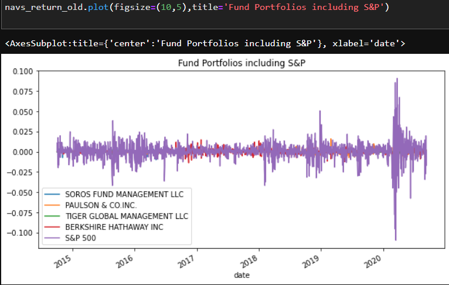
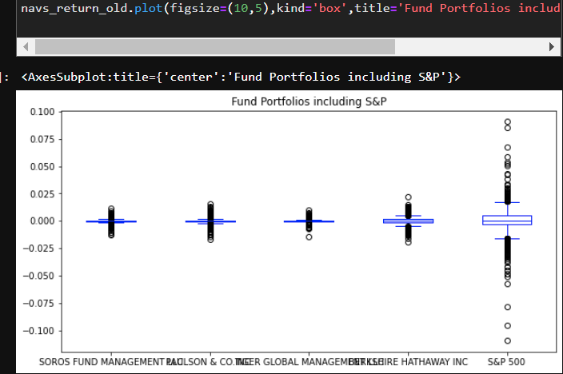
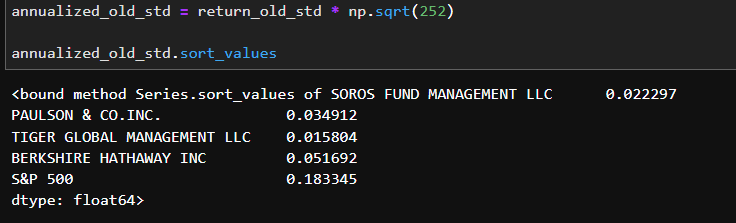
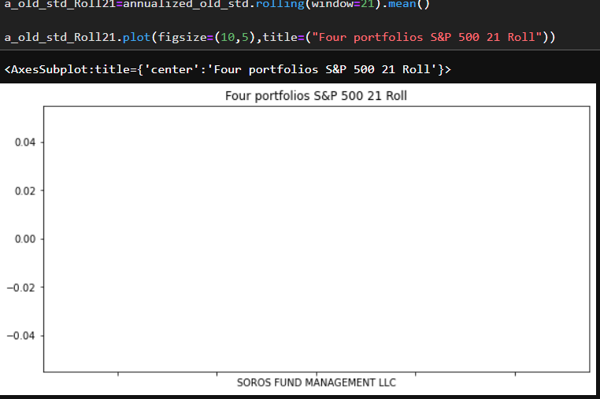
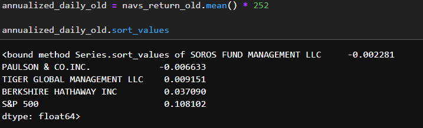
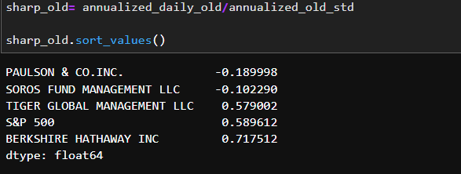
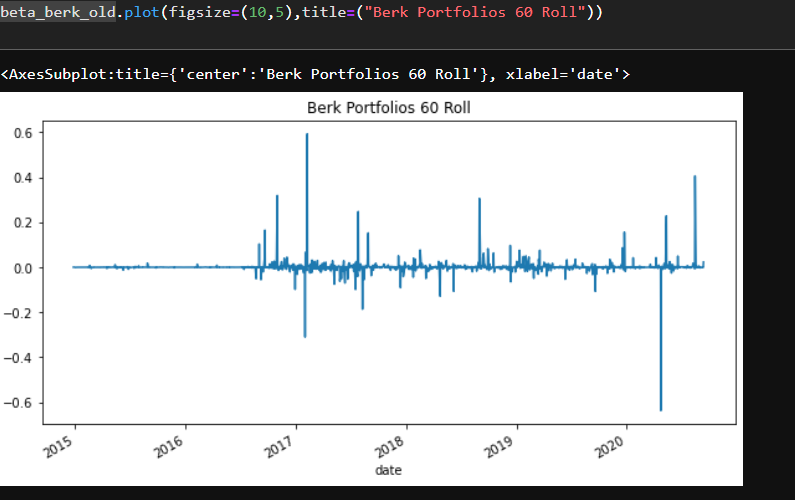
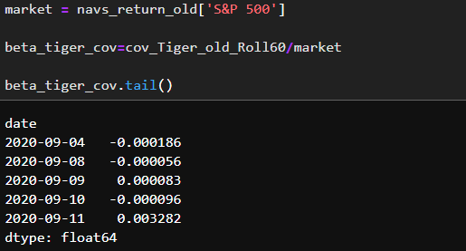
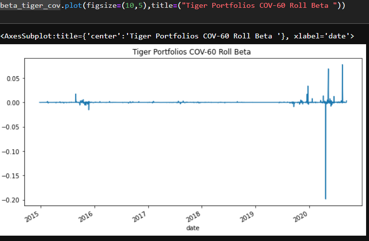

`Quantitative Analyst` *for a FinTech investing platform. This platform aims to offer clients a one-stop online investment solution for their retirement portfolios that’s both inexpensive and high quality. (Think about Wealthfront (Links to an external site.) or Betterment (Links to an external site.)). To keep the costs low, the firm uses algorithms to build each client's portfolio. The algorithms choose from various investment styles and options.* 
**You've been tasked** *with evaluating four new investment options for inclusion in the client portfolios. Legendary fund and hedge-fund managers run all four selections. (People sometimes refer to these managers as whales because of the large amount of money that they manage). You’ll need to determine the fund with the most investment potential based on key `risk-management metrics`: the daily returns, standard deviations, Sharpe ratios, and betas.*

>👨🏿‍⚖️[click here](https://www.teamly.com/blog/quantitative-business-analysis/) to understand how  Quantitiave analysis help businesses 

## Quantitative Analyst 📈💡

# STEP 1
 * Analyze the Performance   
 
 >👨🏿‍⚖️Analyze the data to determine if any of the portfolios outperform the broader stock market, which is the S&P 500
  
  

 >👨🏿‍⚖️*This is 4 Fund Porfolio including  S&P500*

  WE can infer that `BERKSHIRE HATHAWAY INC` Fund porfolio performance is greater than    the other porfolio 

# STEP 2

* Analyze the Volatility

>👨🏿‍⚖️Analyze the volatility of each of the four fund portfolios and of the S&P 500 Index by using box plots.

👨🏿‍⚖️ Why do we use Box plot ? [click here](https://www.statology.org/when-to-use-box-plot/)

>💡Most volatile is plot with the `greatest spread` Least volatile is plot with the `smallest spread`

# STEP 3
* Analyze the Risk
>👨🏿‍⚖️Evaluate the risk profile of each portfolio by using the [standard deviation](https://www.indeed.com/career-advice/career-development/how-to-calculate-standard-deviation) and the [beta](https://www.investopedia.com/terms/b/beta.asp)

    Standard deviation

  

  Rolling Metrics
 >👨🏿‍⚖️rolling metrics are good for start to end dates [click here](https://www.profitwell.com/recur/all/rolling-metric-saas-metrics-hide-problems-and-opportunities) to learn more
  
  

  On a 21 day rolling period there was no porfolio risk more than [S&P500](https://www.investopedia.com/ask/answers/041315/what-are-pros-and-cons-using-sp-500-benchmark.asp#:~:text=The%20Standard%20%26%20Poor%27s%20500%20Index%20%28S%26P%20500%29,500%20as%20a%20benchmark%20for%20their%20individual%20portfolios.)

  # STEP 4
* Analyze the Risk to Return

 Risk to Return
 
 

 Sharp Ratios

 

>📈Click [Risk to return](https://www.investopedia.com/terms/r/riskrewardratio.asp) or [Sharp Ratio](https://www.freshbooks.com/en-gb/hub/accounting/sharpe-ratio#:~:text=Sharpe%20Ratio%20Formula%201%20Rx%20%3D%20Expected%20average,3%20StdDev%20Rx%20%3D%20Standard%20Deviation%20of%20return) to learn more

Sharp ratio Bar Graph

>📈 Graphs tell us a lot information [click here](https://corporatefinanceinstitute.com/resources/excel/study/types-of-graphs/) to learn more on when to use certain graphs

# STEP 5

* Diversify the Portfolio
 >👨🏿‍⚖️evaluate how the portfolios react relative to the broader market

  BERKSHIRE HATHAWAY 
  

  

   TIGER GLOBAL
   

   

   >👨🏿‍⚖️Tiger global has less sensible movement then Berkshire we can can visual see the difference
   
    📈Tiger global is the recommended portfolio for fund offerings compared to Berkshire
  ## REQUIREMENTS
 *As of 5/4/22*
 
 PYTHON 3.10 [click here](https://www.python.org/downloads/)

PANDAS [click here](https://pandas.pydata.org/pandas-docs/stable/getting_started/install.html)

PATHLIBS [click here](https://pypi.org/project/pathlib/)

JUPYTER LAB [click here](https://jupyterlab.readthedocs.io/en/stable/getting_started/installation.html)

## INSTALLATION

>👨🏿‍⚖️install  zip downloand or clone 
   
   [click here](https://github.com/brprod8/Quantitative_Analyst/archive/refs/heads/main.zip) for zip file

   [Click here](https://github.com/brprod8/Quantitative_Analyst/edit/main/README.md) to visit  GITHUB for CLONE
## LICENSE
**Open to Experiment**

BY:ROBERT SMITH

 CREDIT: UC BERKELEY

 EMAIL - Brprod8@gmail.com for Colloboration 

## FACTS

 [Risk management and portfolio](https://www.arborinvestmentplanner.com/portfolio-diversification-definition-and-purpose/#:~:text=In%20finance%20and%20investment%20planning%2C%20portfolio%20diversification%20is,should%20include%20diversification%20rules%20that%20are%20strictly%20followed.) diversification are two key aims of quantitative analysis.Metrics like the variance, beta, and rolling beta, can be calculated per portfolios. The purpose will be to determine the volatility of the portfolios relative to the market, as represented by the S&P 500. By finding the beta, you’ll be able to assess the risk profile of each portfolio.

 >📈Quantitative Analyst made simple with [pandas](https://www.journaldev.com/55404/pandas-data-analysis#:~:text=%20Pandas%20for%20Data%20analysis%20%201%20Pandas,merging%2C%20concatenating%20and%20reshaping%20as%20well.%20More%20)
